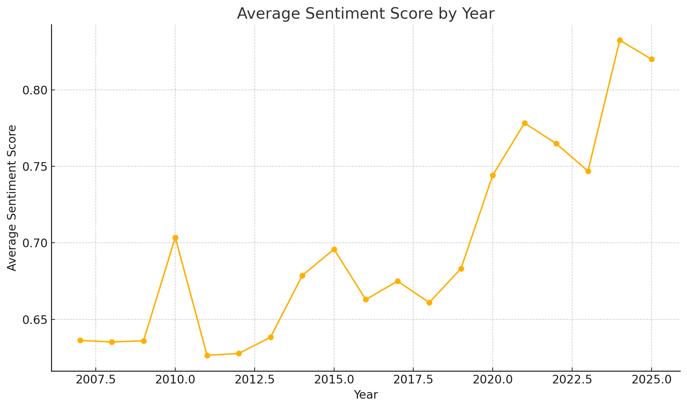

# The Data Introspection Project

The Data Introspection Project is the latest in my attempts to make something interesting out of my personal social media archives. Right now, the project consists of a few scripts that I use to consolidate data and information from Facebook and LinkedIn, create a local SQL database, and use a locally running ollama instance to assign a single word sentiment to each message/post.


_The incidents in 2010 and 2012 represent my immaturity in romantic collegiate relationships, if you were curious_

## Data Preparation
The scripts assume that you have two .csv files, one from from Facebook (your_name_messages.csv) and one from LinkedIn (Shares.csv). The data has been prepared so that each CSV file has a `Date` column and a `Message` column. The python script `load_to_sql.py` assumes you have a `db.sqlite` database in the `/data/` directory, and handles the import of the files into a new `content` table within `db.sqlite` with the following schema:

```
CREATE TABLE content (
    YEAR INTEGER,
    MONTH INTEGER,
    MESSAGE TEXT,
    PLATFORM TEXT,
    SENTIMENT TEXT
);
```

Optionally, you can create additional tables in the database to map relevant life characteristics (where you live, meaningful relationships) to join the main `content` table on. I have a `relationships` table with the following schema: 

```
CREATE TABLE relationships (
    YEAR INTEGER,
    MONTH INTEGER,
    PARTNER STRING
);
```

The `load_to_sql.py` script also assigns the `platform` string automatically based on the file. This will be helpful in doing any kind of visualization or introspection that involves differentiating between how I talk on Facebook vs. LinkedIn.

## Assigning sentiment
The `sentiment.py` script populates the `sentiment` string through a long series of local Ollama calls. I found that this worked really well with llama3.1, but feel free to test out different models as well. The script parses through each row of the `db.sqlite` database `content` table and sends the `message` string in a request to Ollama with the prompt: "Give a one-word sentiment that best describes the following message. Respond with only one word."

> [!TIP]
> I can't really recommend doing this with a hosted API as-written, because it's a lot of individual API calls. If you do, batch the response/queries in some way because otherwise it might get costly and/or rate-limited.

My database contains 199,886 rows, and it took around three hours to complete the script.

```
sqlite> select count(*) from content;
199886
```

This translates to just over 10.5 million tokens as input to the LLM on my machine from the messages alone - excluding the prompt.

```
sqlite> select sum(length(message)) from content;
10569965
```

This was free(excluding the electricity used by my computer) using Ollama. According to the OpenAI pricing page, the 10,569,965 tokens plus the 19,189,056 tokens for the prompt (199,886 * 96 characters) with 1.75M tokens as output would cost about $76 with GPT-4.1, $14 with GPT-4.1 mini, or $4 with GPT-4.1 nano.

## Word Cloud
This was the most straightforward way that I could think of to visualize the messages. I did some cleaning of the sentiment column (The LLM would sometimes choose to add a period at the end of the sentiment, so it was counted as two separate emotions) and generated a script to make a word cloud using the `WordCloud` python package.

## Sentiment Score
The `sentiment_score.py` script is similarly structured to the `sentiment.py` script, and is designed to be run after assigning a sentiment to each message. The sentiment score assigns a value between 0 (the most negative) and 1 (the most positive) for the sentiment of each row in the database. This took several hours to run using local Ollama. You would be advised to remove the print statement in the script, and again, batching here would be a significant improvement if the output of the LLM was consistent enough.



The above image is a graph of the output of the below query once the sentiment_score has been assigned.

```
sqlite> select year, avg(sentiment_score) as average_sentiment from content group by year order by year;
```

## Why tho?
I don't know, don't you ever dive deep into data introspection in order to get a better sense of your self, purpose, and how you've grown? #QuantifiedSelf. If the public companies that have advertised to me on Meta can generate over 13 trillion dollars in market value based on my data, maybe I can find some value in it, too.
